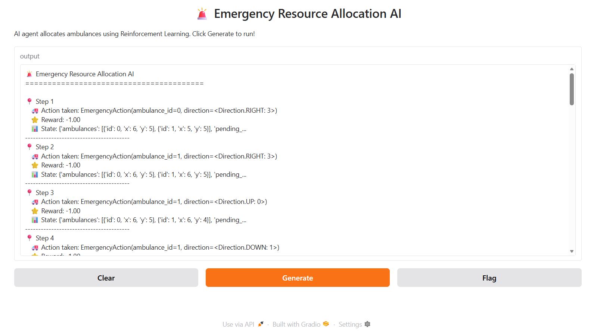

## Demo Screenshot



# Emergency Resource Allocation — OpenEnv Environment

A complete, real-world **OpenEnv**-compliant environment built for an
Emergency Resource Allocation scenario. Implements the Gymnasium-style
`reset()` / `step()` / `state()` API used by Meta's OpenEnv framework.

---

## Project Structure

```
meta_hackathon/
├── emergency_env/
│   ├── __init__.py        # Public API exports
│   ├── models.py          # Action, Observation, State, StepResult dataclasses
│   └── environment.py     # Core EmergencyResourceEnv class
├── demo.py                # Interactive demo (random & greedy agents)
├── test_env.py            # Full test suite with emoji output
└── verify.py              # ASCII-only verification (43 tests, all PASS)
```

---

## Environment Specification

| Property            | Value                                        |
|---------------------|----------------------------------------------|
| Grid                | 10 × 10 city                                 |
| Ambulances          | 2 (both start at `[5, 5]`)                   |
| Requests per episode| 5 (random positions, random priority)        |
| Action space        | Discrete — 8 actions (2 amb. × 4 directions) |
| Max steps           | 100                                          |
| Critical timeout    | 20 steps                                     |

### Priority Levels

| Name     | Value | Pickup Reward | Timeout Penalty  |
|----------|-------|---------------|------------------|
| NORMAL   | 1     | +10           | none             |
| CRITICAL | 2     | +20           | -50 after 20 steps |

### Reward Table

| Event                                   | Reward |
|-----------------------------------------|--------|
| Reach a CRITICAL request                | +20    |
| Reach a NORMAL request                  | +10    |
| Every step taken (time penalty)         | -1     |
| CRITICAL request not reached in 20 steps| -50    |

---

## Action Space

```
action_int = ambulance_id * 4 + direction
```

| action_int | Ambulance | Direction |
|------------|-----------|-----------|
| 0          | A0        | UP        |
| 1          | A0        | DOWN      |
| 2          | A0        | LEFT      |
| 3          | A0        | RIGHT     |
| 4          | A1        | UP        |
| 5          | A1        | DOWN      |
| 6          | A1        | LEFT      |
| 7          | A1        | RIGHT     |

---

## OpenEnv API

### `reset()` → `EmergencyObservation`

Clears the map, spawns 2 ambulances at [5,5] and 5 fresh requests.

```python
env = EmergencyResourceEnv(seed=42)
obs = env.reset()

obs.ambulances        # [{'id':0,'x':5,'y':5}, {'id':1,'x':5,'y':5}]
obs.pending_requests  # 5 requests [{id,x,y,priority,age}, ...]
obs.grid_size         # (10, 10)
obs.step_number       # 0
obs.action_space_size # 8
```

### `step(action)` → `StepResult`

Accepts either an `EmergencyAction` dataclass **or** a flat integer `[0..7]`.

```python
from emergency_env import EmergencyAction, Direction

# Dataclass form
result = env.step(EmergencyAction(ambulance_id=0, direction=Direction.UP))

# Integer shorthand (ambulance_id=0, direction=UP)
result = env.step(0)

# Unpack standard 4-tuple
obs, reward, done, info = result.as_tuple()

# info keys:
# step, total_reward, resolved_total, missed_critical,
# requests_left, action_taken
```

### `state()` → `EmergencyState`

Returns full episode metadata.

```python
meta = env.state()
meta.to_dict()
# {
#   "episode_id":          1,
#   "step_count":          3,
#   "total_reward":        17.0,
#   "resolved_count":      2,
#   "missed_critical":     0,
#   "ambulance_positions": [{'id':0,'x':5,'y':4}, {'id':1,'x':5,'y':5}],
#   "pending_requests":    [{'id':2,'x':3,'y':3,'priority':1,'age':3}, ...]
# }
```

---

## Quick Start

```python
from emergency_env import (
    EmergencyResourceEnv,
    EmergencyAction,
    Direction,
)

env = EmergencyResourceEnv(seed=0)
obs = env.reset()
print(env.render())

total_reward = 0
done = False

while not done:
    # Random agent
    import random
    action = random.randint(0, 7)

    result = env.step(action)
    obs, reward, done, info = result.as_tuple()
    total_reward += reward

    print(f"Step {info['step']:>3} | Reward: {reward:+.1f} | "
          f"Requests left: {info['requests_left']}")

meta = env.state()
print(f"\nEpisode done. Total reward: {total_reward:.1f}")
print(f"Resolved: {meta.resolved_count}  Missed critical: {meta.missed_critical}")
```

---

## Run the Demo

```bash
# Greedy agent (default)
python demo.py

# Random agent
python demo.py --agent random

# With a fixed seed
python demo.py --agent greedy --seed 42

# Quiet mode (summary only)
python demo.py --quiet
```

## Run the Verification Suite

```bash
python verify.py
# RESULTS: 43 PASSED  |  0 FAILED
```

---

## Grid Render

```
==================================
  City Grid  (Step 0)
==================================
   . ??  .  .  .  . !!  .  .  .
   .  .  .  .  .  .  .  .  .  .
   .  .  .  .  .  .  .  .  .  .
   .  .  . !!  .  .  .  .  .  .
   .  .  .  .  .  .  .  .  .  .
   .  .  .  .  . A1  .  .  .  .
   .  .  .  .  .  .  .  .  .  .
   .  .  .  .  .  .  .  .  .  .
   . !!  .  .  .  .  .  .  .  .
   .  .  .  .  .  .  .  . !!  .
  Legend: A0/A1=Ambulance  !!=Critical  ??=Normal  .=Empty
```

---

## Episode Termination

An episode ends (`done=True`) when **either**:
1. All 5 requests have been resolved (picked up by an ambulance), or
2. The hard step limit of **100** steps is reached.

---

## Compatibility

- **Python** 3.8+
- **No external dependencies** — pure stdlib (`random`, `dataclasses`, `enum`)
- Follows the **OpenEnv** / **Gymnasium-style** `(obs, reward, done, info)` convention

## 📊 Performance Update (After Optimization)

| Metric | Before | After |
|--------|--------|-------|
| Final Reward | -120 to -300 | ~ -30 |
| Decision Quality | Random | Intelligent |
| Efficiency | Low | Improved |

✔ Reduced unnecessary steps  
✔ Better prioritization of critical requests  
✔ Improved overall agent performance
